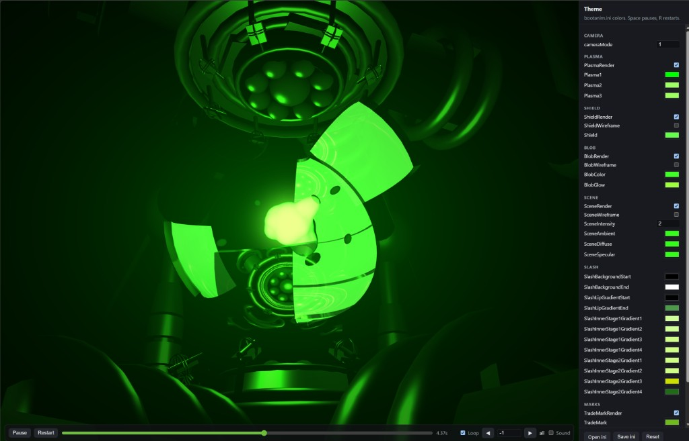

# Flubber Forge

<p align="center"><b>The original Xbox boot animation, rebuilt as a static WebGL canvas — real extracted geometry, real camera paths, real timing, and live <code>bootanim.ini</code> theming</b></p>

<p align="center"><a href="https://team-resurgent.github.io/FlubberForge/"><b>▶ Run it and read the docs at team-resurgent.github.io/FlubberForge</b></a></p>

<p align="center">
  <a href="https://team-resurgent.github.io/FlubberForge/"></a>
  <a href="https://github.com/Team-Resurgent/FlubberForge/blob/main/LICENSE"></a>
  <a href="https://github.com/Team-Resurgent/FlubberForge/releases"></a>
  <a href="https://discord.gg/VcdSfajQGK"></a>
</p>

<p align="center">
  <a href="https://ko-fi.com/J3J7L5UMN"></a>
  <a href="https://www.patreon.com/teamresurgent"></a>
</p>

<p align="center"></p>

## What this is

A faithful port of the Xbox boot animation to WebGL, with every colour in
`bootanim.ini` exposed as a live control so you can design a boot theme and
watch it render at any point on the timeline.

This is not a stylised tribute. The blob is the real cube-sphere with its 32
bumps and 8 bloblets. The scene is the real extracted mesh set, drawn with the
`scene_phong` lighting model. The shields are the sphere patches from
`Shield.cpp`, lit through a port of `shield.psh` and reflecting a static
cubemap baked the same way the original bakes it. The camera follows the
original spline, and the end screen builds its gradients from the original
texture generators rather than approximating them.

## Why it exists

Porting the real Xbox boot animation to the web is something I had always
meant to do and never got round to. Then Arman showed me something he had been
working on, and that was enough of a nudge — I took it upon myself to finally
sit down and do it properly.

So shout out to Arman. Sorry if I stole any of your thunder.

## Running it

Everything under `www/` is static — no build step, no bundler, no server-side
anything. Any static host will do, and a small .NET one ships with the repo so
you do not need to install anything beyond the SDK you already have:

```sh
dotnet run --project tools/DevServer -- --open
```

That serves `www/` on <http://127.0.0.1:8099> and opens a browser. Use
`--port <n>` for a different port and `--root <dir>` to point it somewhere else.
Responses are sent `no-store`, so shader and theme edits show up on reload
without fighting the browser cache.

## Desktop app

There is also a WinForms shell that wraps the same folder in a WebView2 window.
Grab the zip from [Releases](https://github.com/Team-Resurgent/FlubberForge/releases),
unpack it anywhere and run `FlubberForge.exe` — it is self-contained, so no
.NET install is needed. `www/` travels inside the zip next to the executable.

To run it from source instead:

```sh
dotnet run -c Release                 # opens the default theme
dotnet run -c Release -- mytheme.ini  # loads a theme on startup
```

If WebView2 is missing, the host falls back to serving `www/` on localhost and
opening your normal browser.

## Deploying

`.github/workflows/pages.yml` publishes `www/` to GitHub Pages on every push to
`main`, so the live demo above tracks the repo. Enable it once under
**Settings → Pages → Build and deployment → Source: GitHub Actions**.

Nothing about the site is tied to Pages. It is relative-path only, so it works
from a subdirectory, a bare S3 bucket, or a folder opened over a share.

## Theming

The right-hand pane mirrors `bootanim.ini` one key at a time. Edit a colour and
the change lands on the next frame. **Open ini** loads a theme from disk,
**Save ini** writes the current state back out in the same format the Xbox
reads, so the result drops straight into a dashboard or BIOS that consumes it.

The playback bar scrubs the full timeline, and the `-1` box isolates a single
mesh instance if you want to see which part of the machinery is which.

`?t=<seconds>&play=0` on the URL jumps to a fixed frame and holds it, which is
what the screenshot tooling uses.

## Layout

| Path | What lives there |
| --- | --- |
| `www/` | The player. Static HTML and JS, deployable as-is. |
| `www/geometry.json` | Extracted meshes, instance transforms, and the wordmark bitmap. |
| `www/bootanim.ini` | The default green theme. |
| `tools/DevServer/` | Static file server for local development. |
| `tools/extract.js` | Regenerates `geometry.json` from the animation source tree. |
| `tools/make-icon.js` | Redraws `assets/app.ico`. Only needed if the mark changes. |
| `Program.cs` | The optional WebView2 desktop shell. |

`geometry.json` is committed, so you only need `tools/extract.js` if you are
changing what gets pulled out of the source tree.

## Known gaps

- The green fog is an exponential approximation rather than the three scrolling
  plasma textures.
- No shadow maps.
- No boot sound.

## Credits

Built by [Team Resurgent](https://github.com/Team-Resurgent). The animation it
reproduces was originally created by Pipeworks Software for Microsoft; geometry
and timing were derived from that work for interoperability and preservation,
and all Xbox trademarks belong to their respective owners.
